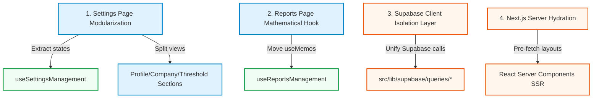

# DeviceDock: Next-Level Performance & Architecture Roadmap

This document outlines strategic architectural optimizations that can be performed next to keep the DeviceDock codebase robust, clean, and highly performant.

---

## 🚀 Future Optimization Themes

---

### 1. Settings Page Refactoring & Section Decomposition [COMPLETED ✅]

- **Target File:** `src/page-components/Settings.tsx` (now modularized down to 110 lines)
- **Status:** Fully completed. State and upload logic extracted to `src/hooks/use-settings-management.ts`. Sub-sections split out into `<CompanySettingsSection />`, `<ProfileSettingsSection />`, `<NotificationSettingsSection />`, and `<InventoryThresholdSection />` under `src/components/settings/`.

---

### 2. Isolate Analytical Math from Reports Layout [COMPLETED ✅]

- **Target File:** `src/page-components/Reports.tsx` (now modularized down to 87 lines)
- **Status:** Fully completed. All `useMemo` analytical computations and filters moved to `src/hooks/use-reports-management.ts` for clean testability and high-performance execution.

---

### 3. Establish a Absolute Supabase Client Isolation Layer [COMPLETED ✅]

- **Target Directories:** `src/page-components/`, `src/hooks/`, `src/contexts/`
- **Status:** Fully completed. All inline Supabase data operations (e.g. `supabase.from("...")`) have been systematically refactored out. They now route through a centralized client isolation layer defined under `src/lib/supabase/queries/` (e.g., `inventory.ts`, `uploads.ts`, `notifications.ts`, `orders.ts`, `settings.ts`). Custom hooks and components cleanly import and invoke these query layer functions, eliminating raw client-side query leakage.

---

### 4. Next.js Hydration & SSR Optimization [COMPLETED ✅]

- **Target Files:** `app/[companySlug]/layout.tsx`, `app/[companySlug]/dashboard/page.tsx`
- **Status:** Fully completed. Leverages request-isolated Next.js Server Components to prefetch the `inventoryAll`, `ordersAll`, and `filterOptions` base queries at layout level, plus `inventoryStats` and `orderStats` at dashboard page level. Data is dehydrated on the server using `dehydrate(queryClient)` and hydrated instantly inside the React Query `<HydrationBoundary>` container on the client, completely eliminating skeleton loading flickers on initial load!

---

### 5. Standardize Custom Hook Folder Structure [COMPLETED ✅]

- **Target Folder:** `src/hooks/`
- **Status:** Fully completed. Segregated generic utilities into `src/hooks/common/` (`use-debounce`, `use-mobile`, `use-toast`, `use-page-param`, `use-paginated-query`, `use-paginated-react-query`) and kept feature-specific hooks at the top-level of `src/hooks/`. Updated all imports across components, UI libraries, query files, and hooks. The entire project builds successfully with zero compilation warnings!
